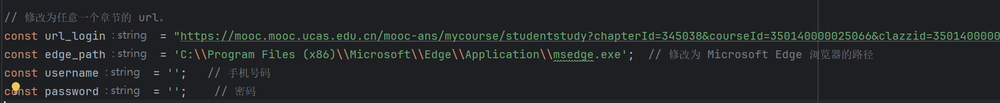
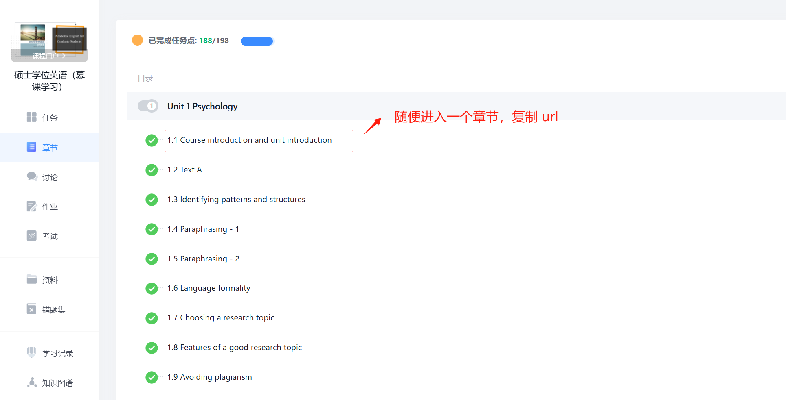
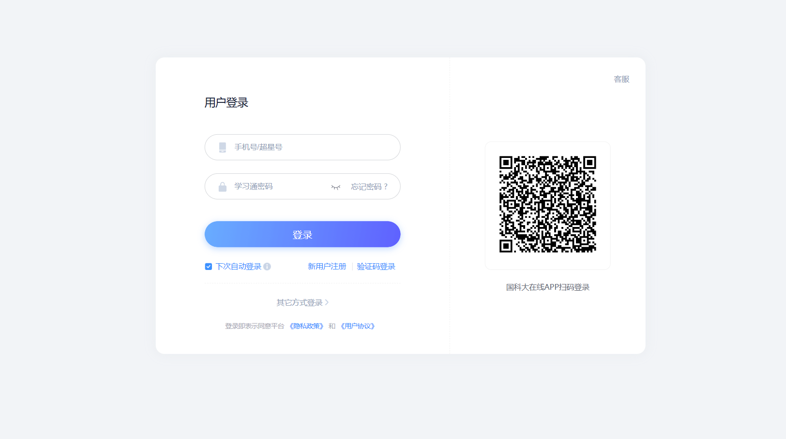
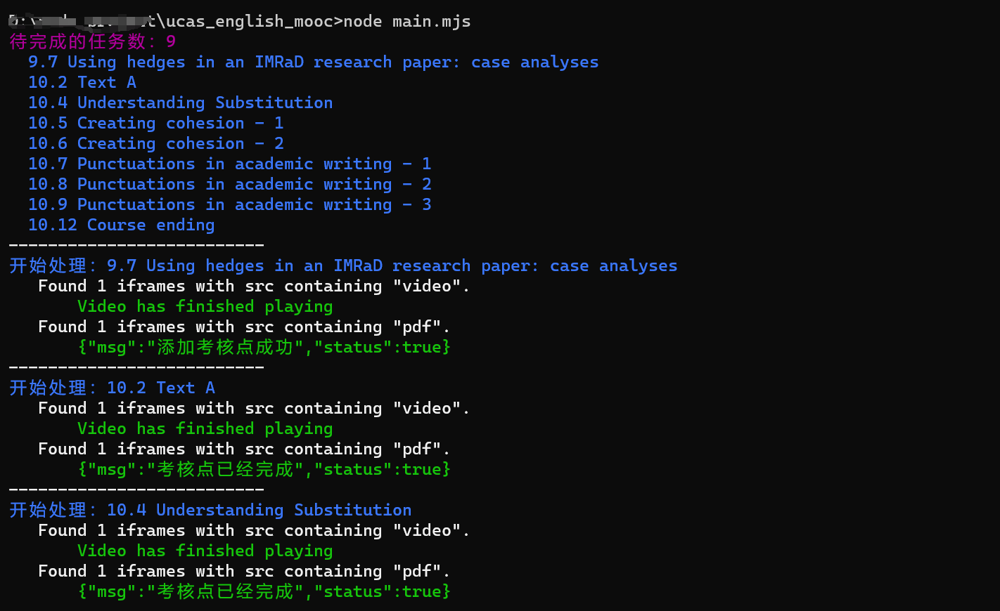

# 前言

本项目可自动完成国科大硕士学位英语（慕课学习）课程中的视频任务点和 PDF 任务点。支持 2 倍速播放视频、鼠标移走不暂停、中途可随时关闭浏览器中断（已完成的进度保存在服务器端，重跑不受影响），只需提供一个课程章节 URL 即可自动刷完整门课。Quiz 需要自己完成。

> 原项目作者：[kejaly](https://github.com/kejaly/ucas_english_mooc)，感谢他的贡献。
>
> 慕课的前端 ui 好像每年都会变，当前脚本已适配 2026 年春季 UI 变更。(2026.05.29)

# 使用

## 1、环境准备

1. 安装 Node.js (>= 18)
2. 安装 pnpm (可选)

```
npm install
# 或者 pnpm install
```

## 2、修改 main.mjs 中如下四个参数信息：



### 获取 url_login

1. 访问国科大在线：https://mooc.ucas.edu.cn/portal
2. 校内登录 -> 信息门户登录
3. 登录之后回到 https://mooc.ucas.edu.cn/portal -> 进入个人空间 -> 选择 "硕士学位英语（慕课学习）" -> 点击章节 -> 随便进入一个章节，复制 url（就是 url_login 参数）



### 获取 username 和 password

在浏览器无痕模式下访问上面获取的 url，会重定向到：

https://passport.mooc.ucas.edu.cn/login



username 和 password 就是这里的手机号和密码。

### 获取 edge_path

- **macOS**（默认）：`/Applications/Google Chrome.app/Contents/MacOS/Google Chrome`
- **Windows**：`C:\Program Files (x86)\Microsoft\Edge\Application\msedge.exe`

> 仅支持 Chromium 内核浏览器（Chrome、Edge、Brave 等），Firefox 和 Safari 不行。也可用 Playwright 自带的 Chromium，删掉 `executablePath` 那行后运行 `pnpm exec playwright install chromium` 即可。

## 3、执行

```
node main.mjs
```

### macOS 防休眠

```
caffeinate -i node main.mjs
```

# 技术实现

基于 playwright 自动化框架。

- **视频**：点击页面原生 Video.js 播放按钮（非直接调 `video.play()`），等待服务器确认 `isPassed: true`。通过定时强制设 `playbackRate = 2` 实现 2 倍速，并持续阻止暂停以绕过鼠标检测。
- **PDF**：直接发包。

# 运行的截图：



# 2026 年改动

2026 年春季慕课页面前端改版，原来的选择器和流程已失效。本次改动：

1. **适配 macOS 和 Chrome**：edge_path 默认指向 macOS 下的 Chrome，Windows 用户改回 Edge 路径即可。
2. **新页面结构适配**：课程树从 `posCatalog_select` 改为了 `#coursetree .ncells`，通过 `textContent` 中的 "Quiz" 关键词过滤测验。
3. **改为 AJAX 模式**：旧版通过页面跳转进入每个小节，新版点击后通过 `getTeacherAjax()` 动态加载内容到 `#iframe`，URL 不变。去掉了 `goBack()`/`reload()` 逻辑，直接遍历左侧课程树依次点击处理。
4. **视频处理重写**：旧版直接操作 `<video>` 元素导致 `playingTime` 始终为 0（服务器不认）。新版改为点击 Video.js 原生播放按钮，让页面自己的播放器正常上报进度。不能伪造完成请求——URL 中 `enc` 参数是签名哈希，篡改 `playingTime` 会导致签名校验失败。通过 `page.on('response')` 监听 `multimedia/log` 响应，`isPassed: true` 即完成。
5. **倍速 + 鼠标检测对抗**：延迟 1.5 秒后每秒强制设 `playbackRate = 2`（覆盖 Video.js 的重置），同时轮询监听 `pause` 事件防止鼠标离开暂停。
6. **PDF 读取 DOM 属性**：`getAttribute("value")` 改为 `inputValue()`，确保读到 AJAX 更新后的值而非 HTML 初始属性。
7. **容错处理**：`deal_video` 和 `deal_pdf` 有空检查，无视频或 PDF 不会崩溃；视频加载失败有降级默认时长。
8. **动态扫描 + 去重**：不预计算任务列表，每轮重新扫描课程树找第一个未完成小节，自动跟随页面翻页。用 `processedIds` 防止同一个小节重复处理。
9. **禁止自动跳转**：拦截 `ended` 事件 + 覆盖 Video.js 的 `trigger` 方法，防止视频播完后页面自动跳到下一节导致丢任务。

**脚本整体流程**：

```
登录 → 每轮重新扫描左侧课程树 → 找到第一个未完成小节（排除 Quiz）
  → 若已处理过则跳过 → 点击 ncells 触发 AJAX 加载到 #iframe
  → 视频：点 Video.js 播放按钮 → 等服务器返回 isPassed: true（2 倍速 + 防暂停 + 禁自动跳）
  → PDF：直接 GET 发包标记完成
  → 重新扫描 → 直到所有小节处理完成
```

**中途中断**：直接关浏览器窗口，脚本自动退出。已完成的操作保存在服务器端，重跑不受影响。